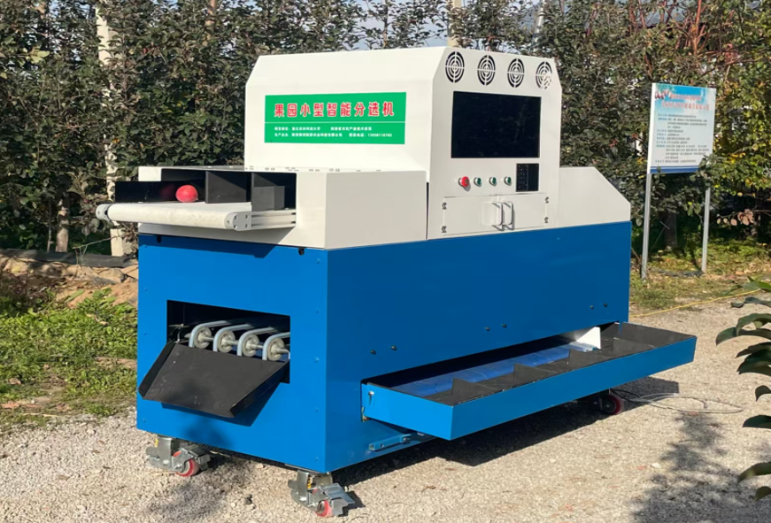
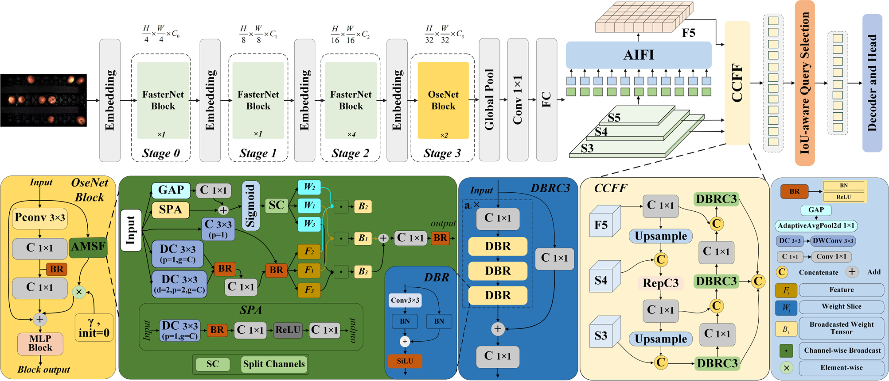
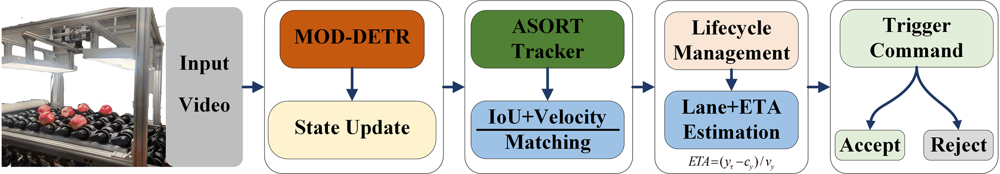

# Apple-defect-sorting


# Overview
This repository presents a compact in-field intelligent apple sorting system designed for small and medium-sized orchards, based on a single-camera, three-lane architecture.
The work focuses on three tightly components:
* defect detection

* target association / tracking
* trajectory-level sorting decision-making


To address long-range defect detection and false rejections caused by single-frame decisions, This research propose:
* MOD-DETR for apple defect detection
* ASORT for lightweight target tracking in constrained sorting scenarios
* a trajectory-level multi-frame defect confirmation strategy for reducing instantaneous false positives

# Main Contributions
* A custom apple defect dataset for in-field sorting scenarios
* MOD-DETR, built on RT-DETR with:
    * FasterNet
    * OSENet
    * AMSF
    * DBRC3
* ASORT, a lightweight tracker for visually similar fruits with constrained motion
* A trajectory-level decision strategy for more stable rejection control
* A compact apple sorting system validated in continuous sorting experiments

# Experimental Results
On the custom apple defect dataset:
* mAP@50: 86.7%
* Improvement over baseline: +1.5 percentage points
* GFLOPs reduction: 29.4
* Inference speed improvement: +23.8 FPS
In the sorting scenario:
* MOTA: 97.8%
* IDF1: 98.9%
* Overall grading accuracy in continuous machine tests: 92.5%

# Repository Status
This repository is currently being prepared for full public release.

# To be released
* Full source code
* Training scripts
* Inference scripts
* Tracking and decision modules
* Model checkpoints
* Reproducibility instructions
* If this repository is being used during peer review, please note that some contents are temporarily withheld to comply with the review and publication process.

# Dataset
A partial version of the dataset is currently available for review:
* Dataset link: https://pan.baidu.com/s/1m_5nDWVRcNsSF2R0qcdfOQ
* Extraction code: uxbs

# Notes
* The project is still ongoing.
* The currently shared dataset is only a partial subset for review purposes.

# Planned Release Contents
The full public release will include the following modules:
```text
Apple-defect-sorting/
|-- Datasets/
|-- Configs/
|-- Models/
|   |-- mod_detr/
|   `-- asort/
|-- Tools/
|   |-- train.py
|   |-- test.py
|   |-- track.py
|   `-- sort_demo.py
|-- Checkpoints/
|-- UI/
|-- Docs/
|-- Ultralytics/
`-- README.md
```

# Reproducibility
The reproducibility package will include:
* environment configuration
* dataset structure and annotation format
* training commands
* evaluation commands
* tracking commands
* system-level sorting demo instructions
* pretrained checkpoints

# Media Coverage
* This project has also been covered by industry media:
https://v.douyin.com/6EQBNfSZf1Q/
* Equipment video:
[[Demo Video]](./video2.mp4)
[[Demo Video]](./Video1.mp4)

# Contact
For questions regarding the dataset or code release, please contact the authors through the paper submission system or the repository issues page after public release.


